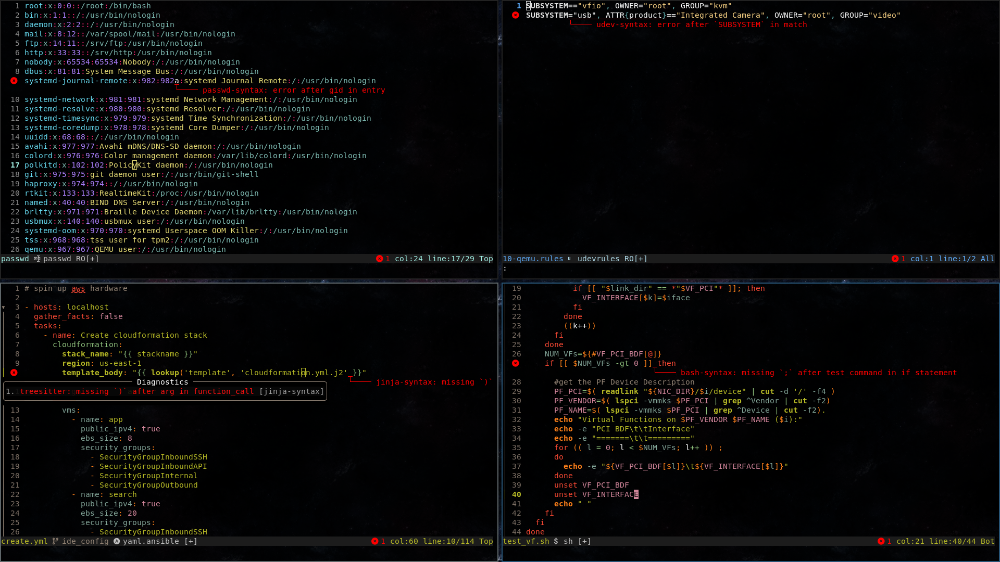

Neovim Treesitter diagnostics
=============================

Query `ERROR` and `MISSING` nodes from Treesitter to emit Neovim diagnostics about syntax errors



## Setup

```vim
autocmd FileType * call v:lua.require'treesitter-diagnostics'.enable(bufnr())
```

## Acknowledgments

This plugin is a continuation of the idea from [treesitter diagnostics](https://www.reddit.com/r/neovim/comments/1ir069p/treesitter_diagnostics/)
thread by [u/robertogrows](https://www.reddit.com/user/robertogrows) on [r/neovim](https://www.reddit.com/r/neovim/)
* [v1 (2025-02-16)](https://pastebin.com/x0pSjk9c)
* [v2 (2025-02-17)](https://pastebin.com/kUSSXzNQ)
  * _"much faster than previous hack due to the special nature of errors, avoids unnecessary queries"_
* [v3 (2025-12-10)](https://pastebin.com/ayZ2UMYf)
  * _"some parsers (...) create lots of errors; injections can be quite noisy so disabled those too"_
  * _"some changes to optimize the performance as well"_
